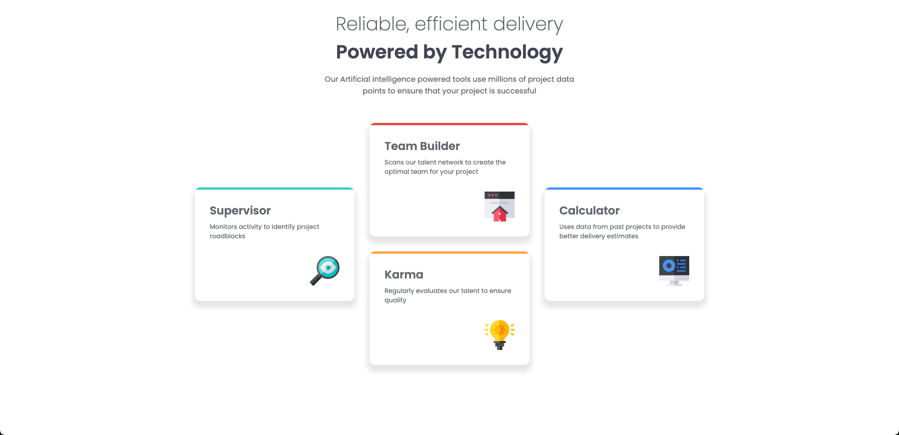

# Frontend Mentor - Four Card Feature Section Solution

This is my solution to the [Four card feature section challenge on Frontend Mentor](https://www.frontendmentor.io/challenges/four-card-feature-section-weK1eFYK)

## Table of Contents 目錄

- [Overview 概述](#overview-概述)
  - [The Challenge 挑戰目標](#the-challenge-挑戰目標)
  - [Screenshot 截圖](#screenshot)
- [My Process 實作過程](#my-process-實作過程)
  - [Built with 使用技術](#built-with-使用技術)
  - [What I Learned 學習心得](#what-i-learned-學習心得)
- [Author 作者](#author-作者)

## Overview 概述

### The Challenge 挑戰目標

### Screenshot 截圖




## My Process 實作過程

### Built with 使用技術

- Semantic HTML5 markup 語義化 HTML5
- CSS custom properties CSS
- CSS Grid CSS
- Flexbox
- Mobile-first workflow

### What I Learned 學習心得

This project was an excellent opportunity to deepen my understanding of CSS Grid layout. I learned how to create a complex grid layout that adapts to different screen sizes. The most interesting part was implementing the unique card arrangement using grid template areas:

這個專案是深入理解 CSS Grid 布局的絕佳機會。我學會了如何創建適應不同螢幕尺寸的複雜網格布局。最有趣的部分是使用網格模板區域實現獨特的卡片排列：

```css
.cards {
  grid-template-columns: repeat(3, minmax(auto, 1fr));
  grid-template-areas:
    ". team ."
    "supervisor team calculator"
    "supervisor karma calculator"
    ". karma .";
}
```

One of the interesting challenges I encountered was adding a colored top border to each card without affecting the card's content. Initially, I tried adding a regular border, but it followed the card's border-radius, which wasn't the desired effect. When I switched to using the `::before` pseudo-element, I discovered it would overlap the border-radius. Finally, I solved this by adding `overflow: hidden` to the card, which maintained both the straight top border and the rounded corners:

我遇到的一個有趣挑戰是為每張卡片添加頂部顏色條。起初，我嘗試添加普通的 border，但發現它會跟隨卡片的 border-radius 產生彎曲效果，這並不是我想要的。當我改用 `::before` 偽元素時，發現它會覆蓋 border-radius。最後，我通過在卡片上添加 `overflow: hidden` 解決了這個問題，這樣既保持了頂部直線條，又保留了圓角效果：

```css
.card::before {
  content: "";
  position: absolute;
  top: 0;
  left: 0;
  height: 5px;
  width: 100%;
}
```

This solution allowed me to:
這個解決方案讓我能夠：

1. Keep the border separate from the main content
   保持邊框與主要內容分離
2. Maintain clean padding inside the card
   保持卡片內部間距的整潔
3. Easily customize different colors for each card type
   輕鬆為每種卡片類型自定義不同的顏色
4. Preserve the card's border-radius while having a straight top border
   在保持頂部直線條的同時保留卡片的圓角效果

## Author 作者

- GitHub - [@ylin320](https://github.com/ylin320)
- Frontend Mentor - [@ylin320](https://www.frontendmentor.io/profile/ylin320)
